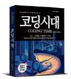

# Data Science Course for JBFG, 2022

Python For BigData @ <a href='https://www.facebook.com/jskim.kr'>FB / jskim.kr</a>, [김진수](bigpycraft@gmail.com)

 

## JB Financial Group

## Notice 
- [교육자료] : https://github.com/bigpycraft/ds22-jbfg-mc
- [공유폴더] : \192.15.206.251\ds\jbfg
- [PY-NEWS] : HTML에서 동작하는 Python 등장!!!  
- [Py-NEWS] : https://pyscript.net/  ← [Py-Scrtipt.Net] Link 

## DS Course Overview
- 교육과정 : 데이터 분석 과정
- 교육장소 : 멀티캠퍼스 선릉캠퍼스 304호
- 교육일정 : 2022.05.09(월) ~ 06.24(금), 총33일 (6/1 지방선거일, 6/6 현충일 휴강)
- 교육시간 : 9:00am ~ 6:00pm, 264H
- 코로나 확진자 발생시 당일 비대면전환 (음성 확인시 익일 대면 가능), ∴ 개별 PC가 준비가 되어야 함

## Table of Contents
- [Python Programming Basics             ][Sect-A]
- [Jupyter Notebook Practice             ][Sect-B]
- [Python Packages and Modules           ][Sect-C]
- [Essential Packages for Data Analysis  ][Sect-D]
- [Data Processing and Analysis          ][Sect-E]
- [Data Collecting and Web Cralwling     ][Sect-F]
- [Korean Natural Language Processing    ][Sect-G]
  
- [특강1 - Database and SQL               ][Sect-H]
- [특강2 - AI & ML/DL Overview            ][Sect-M]
- [특강3 - Coding Era, Why Big Data?      ][Sect-Z]
  

## Team Project
- [Pilot Project 1st - Golf Score Mgr    ][Proj-1]
- [Pilot Project 2nd - Fin.Data Analysis ][Proj-2]
- [Final Project 3nd - Solve the Problem ][Proj-3]
- [데이터분석 프로젝트 - Guide ][P-guide]
  

[Sect-A]: ./Sect-A/                  "Go Sect-A"
[Sect-B]: ./Sect-B/                  "Go Sect-B"
[Sect-C]: ./Sect-C/                  "Go Sect-C"
[Sect-D]: ./Sect-D/                  "Go Sect-D"
[Sect-E]: ./Sect-E/                  "Go Sect-E"
[Sect-F]: ./Sect-F/                  "Go Sect-F"
[Sect-G]: ./Sect-G/                  "Go Sect-G"
[Sect-H]: ./Sect-H/                  "Go Sect-H"
[Sect-M]: ./Sect-M/                  "Go Sect-M"
[Sect-Z]: ./Sect-Z/                  "Go Sect-Z"

[Proj-1]: ./Team-Project/pilot_project_1st/   "Go Proj-1"
[Proj-2]: ./Team-Project/pilot_project_2nd/   "Go Proj-2"
[Proj-3]: ./Team-Project/final_project_3rd/   "Go Proj-3" 
[P-guide]: ./Team-Project/DS100_데이터분석_프로젝트_Guide_ver1.pdf   "Go P-guide" 

 

## Python Develop Environment

### Python

<table align="left">
    <tr align="left">
        <td width="200">
            
        </td>
        <td width="800">

<b> Latest: Python 3.10.4 - March 24, 2022</b>
  
- Download : https://www.python.org/downloads/windows/
 
- Download the latest version 
 
- Check the OS version & bit (32bit / 64bit)

</td>
    </tr>
</table>
 
 

### PyCharm

<table align="left">
    <tr align="left">
        <td width="200">
            
        </td>
        <td width="800">

<b> Latest : Python 3.10 version</b>
  
- Download : https://www.jetbrains.com/pycharm/download/
 
- Build: 221.5080.212
 
- Release Date: 13 April, 2022
 
- Download Community Version 

</td>
    </tr>
</table>
 
 

### Jupyter Notebook

<table align="left">
    <tr align="left">
        <td width="200">
            
        </td>
        <td width="800">

<b> Latest : Version 2021.11 | Release Date: November 17, 2021 </b>
 
- Python 3.9 version
 
- Filename : Anaconda3-2021.11-Windows-x86_64.exe
 
- Download : https://www.anaconda.com/distribution/
 
- Check the OS version & bit (32bit / 64bit)

 

<b> Recommand Previous: Version 5.2 | Release Date: May 30, 2018 </b>
 
- Filename : Anaconda3-5.2.0-Windows-x86_64.exe
 
- Download : https://repo.anaconda.com/archive/
 
- Reason : TF Requires Python 3.4, 3.5, or 3.6 
 
- TensorFlow : https://www.tensorflow.org/install/pip

</td>
    </tr>
</table>
 
 

### Selenium WebDriver 

<table align="left">
    <tr align="left">
        <td width="200">
            
        </td>
        <td width="800">

    <b> - Selenium HQ </b> : https://www.seleniumhq.org/projects/webdriver/
       - 아래 사이트에서 OS에 맞는 웹드라이브를 다운받아 압축을 풀어 driver 폴더에 복사
      
    <b> 1. Chrome WebDriver </b> &nbsp;&nbsp; : <a href='http://chromedriver.chromium.org/downloads'>[다운로드1]</a>, &nbsp;&nbsp;&nbsp;<a href='https://sites.google.com/a/chromium.org/chromedriver/downloads'>[다운로드2]</a>
      
    <b> 2. Firefox WebDriver </b> &nbsp;&nbsp;&nbsp;&nbsp; : <a href='https://github.com/mozilla/geckodriver/releases'>[다운로드]</a>
      
    <b> 3. Microsoft WebDriver </b> : <a href='https://developer.microsoft.com/en-us/microsoft-edge/tools/webdriver/'>[다운로드]</a>
      
    <b> ※ 가장 보편적으로 많이 사용하는 크롬 웹드라이브를 다운받아서 설치한다. </b>

        </td>
    </tr>
</table>
 

### KoNLPy Install Guide  

<table align="left">
    <tr align="left">
        <td width="200">
            
        </td>
        <td width="800">

    <b> 1. JAVA 환경 </b> : <a href="https://www.oracle.com/technetwork/java/javase/downloads/">JDK (>=1.8)</a> Install & JAVA Environmnmet Variable Setting
      
    <b> 2. MS Visual C++ 설치 </b> : <a href='https://visualstudio.microsoft.com/ko/visual-cpp-build-tools/'>[다운로드1]</a>, &nbsp;&nbsp;&nbsp;<a href="https://www.scivision.co/python-windows-visual-c++-14-required/">[다운로드2]</a> 
      &nbsp;&nbsp; - 최소사양 : Build Tools for Visual Studio 2017 (>=14.0) Install
      
    <b> 3. JPype 설치 </b> : <a href="https://www.lfd.uci.edu/~gohlke/pythonlibs/#jpype">JPype1  (>=0.5.7) </a>Install
      &nbsp;&nbsp; (Anaconda Prompt) C:\Users\user> <b> pip install --upgrade pip </b>
      &nbsp;&nbsp; (Anaconda Prompt) C:\Users\user> <b> pip install JPype1‑0.6.3‑cp36‑cp36m‑win_amd64.whl </b>
      
    <b> 4. KoNLPy 설치 </b> :
      &nbsp;&nbsp; (Anaconda Prompt) C:\Users\user> <b> pip install konlpy </b>

        </td>
    </tr>
</table>
 

### JDK Install & JAVA Environment Setting

<table align="left">
    <tr align="left">
        <td width="200">
            
        </td>
        <td width="800">

 
    <b> - Download </b> : https://www.oracle.com/technetwork/java/javase/downloads/
       
    <b> - 시스템 환경변수 </b>
       
    <b> 1. JAVA_HOME </b> = C:\Java\jdk1.8.0
       
    <b> 2. Path </b> = %Path%; %JAVA_HOME%\bin
      
    <b> 3. CLASSPATH </b> = .; %JAVA_HOME%\lib;

        </td>
    </tr>
</table>
 

### Coding Era - Interview on BigData

<table align="left">
    <tr align="left">
        <td width="200">
            
        </td>
        <td width="800">

 
    <b> - 코딩시대, Coding Time </b>
       
    <b> - Prologue </b>: 미래 변화를 대비하기 위해 코딩역량을 키우자!!!
       
    <b> - INDEX </b> : <a href="Sect-Z/코딩시대_목차.pdf">[코딩시대 - 목차]</a>
       
    <b> - INTERVIEW </b> : <a href="Sect-Z/코딩시대_인터뷰_빅데이터전문가.pdf">데이터를 다루는 것은 4차 산업혁명에서 기본</a>

        </td>
    </tr>
</table>
 

<marquee>The BigpyCraft find the information to design valuable society with Technology & Craft.</marquee>

 &lt; The End &gt; 

