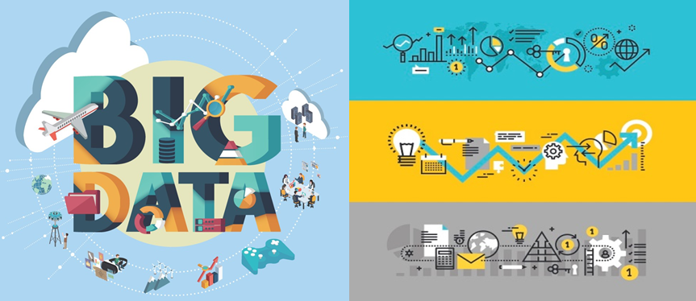

# Data Science Course for JBFG, 2022

Python For BigData @ <a href='https://www.facebook.com/jskim.kr'>FB / jskim.kr</a>, [김진수](bigpycraft@gmail.com)

<h2><b>Final Project III</b></h2>

- <b>Project Mission </b> : <b>Data Analysis For Solving the Problem </b>

 

## 프로젝트 개요

- 프로젝트 미션 : 문제해결을 위한 데이터분석 프로젝트
- 프로젝트 목표 : 데이터수집에서 최종분석보고서 작성까지 협업을 통한 프로젝트 수행
- Keep in Mind : Learning by doing, doing by learning !!

## 프로젝트 일정

- Team Building : 2022.06.15(수) - 팀빌딩 (소속 은행별) 
- 착수보고  발표 : 2022.06.17(금) - 착수보고서 제출 및 발표 
- 결과보고  취합 : 2022.06.23(목) - 프로젝트 산출물 하나의 압축파일로 제출
- 최종보고  발표 : 2022.06.24(금) - 결과보고 발표 및 시현

## Reference Documents

- Proj-01. [프로젝트 가이드 ][Proj-01]
- Proj-02. [문제정의서 포맷 ][Proj-02]
- Proj-03. [착수보고서 포맷 ][Proj-03]

[Proj-01]: ../DS100_데이터분석_프로젝트_Guide_ver1.pdf   "Go Proj-01" 
[Proj-02]: ./S110_문제정의서_포맷1.pptx                  "Go Proj-02" 
[Proj-03]: ./S100_착수보고서_OOO팀.docx                  "Go Proj-03" 

 

<marquee>The BigpyCraft find the information to design valuable society with Technology & Craft.</marquee>

 &lt; The End &gt; 

