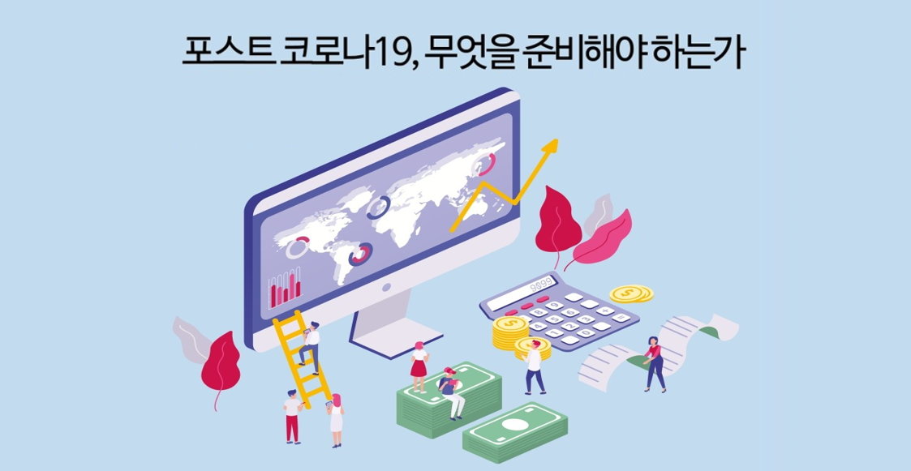

# Data Science Course for JBFG, 2022

Python For BigData @ <a href='https://www.facebook.com/jskim.kr'>FB / jskim.kr</a>, [김진수](bigpycraft@gmail.com)

<h2><b>Final Project III</b></h2>

- <b>Project Mission </b> : <b>Data Analysis For Solving the Problem </b>

 

## 프로젝트 개요

- 프로젝트 미션 : 문제해결을 위한 데이터분석 프로젝트
- 프로젝트 목표 : 데이터수집에서 최종분석보고서 작성까지 협업을 통한 프로젝트 수행

## 프로젝트 일정

- Team Building : 2022.06.15(수) - 팀빌딩 (소속 은행별) 
- 착수보고  발표 : 2022.06.17(금) - 착수보고서 제출 및 발표 
- 결과보고  취합 : 2022.06.23(목) - 프로젝트 산출물 하나의 압축파일로 제출
- 최종보고  발표 : 2022.06.24(금) - 결과보고 발표 및 시현

## Reference Documents

- Proj-01. [프로젝트 가이드 ][Proj-01]
- Proj-02. [문제정의서 포맷 ][Proj-02]
- Proj-03. [착수보고서 포맷 ][Proj-03]

[Proj-01]: ../DS100_데이터분석_프로젝트_Guide_ver1.pdf   "Go Proj-01" 
[Proj-02]: ./S110_문제정의서_포맷1.pptx                  "Go Proj-02" 
[Proj-03]: ./S100_착수보고서_OOO팀.docx                  "Go Proj-03" 

##  Team Project : Final Report
- <b>Submission   </b>: 착수보고(문제정의서 & WBS작성) + 소스코드취합(분석코드 & 분석데이터 포함) + 최종분석보고서PT
- <b>Presentation </b>: 2022.06.24(금)
- <b>Keep in mind </b>: <b> Learning by doing, doing by learning !! </b>

### Project Team A - 전북은행

<table border=1 width=100%>
	<tr>
		<td width="25%">
<b>Project Team</b>
</td>
		<td width="75%">
 선릉파이터 팀 
</td>
	</tr>
	<tr>
		<td>
<b>Team Members</b>
</td>
		<td>
 팀장 : 박요온,  &nbsp;&nbsp;&nbsp; 팀원 : 오승현, 한혜형, 김영목, 박성실 
</td>
	</tr>
	<tr>
		<td>
<b>Report</b>
</td>
		<td>
			
 
				<a href="T1_전북은행/S10_기획단계/S110_문제정의서.pdf">[문제정의서]</a>, 
				&nbsp;&nbsp;&nbsp; 
				<a href="T1_전북은행/S10_기획단계/S100_착수보고서.pdf">[착수보고서]</a>,  
				&nbsp;&nbsp;&nbsp; 
				<a href="T1_전북은행/S10_기획단계/S120_WBS.png">[WBS-범위/일정관리]</a>,
				&nbsp;&nbsp;&nbsp; 
				<a href="T1_전북은행/S20_분석단계/">[데이터분석]</a>,
				&nbsp;&nbsp;&nbsp; 
				<a href="T1_전북은행/S30_최종보고/S300_최종분석보고서.pdf">[결과보고서]</a>
			

		</td>
	</tr>
	<tr>
		<td>
<b>Subject</b>
</td>
		<td>
 Covid19 전/후 업종별 매출액 변화 분석
</td>
	</tr>
	<tr>
		<td>
<b>Presentation</b>
</td>
		<td>

</td>
	</tr>
</table>

### Project Team B - 광주은행

<table border=1 width=100%>
	<tr>
		<td width="25%">
<b>Project Team</b>
</td>
		<td width="75%">
 I.N.E 팀
</td>
	</tr>
	<tr>
		<td>
<b>Team Members</b>
</td>
		<td>
 팀장 : 최대훈,  &nbsp;&nbsp;&nbsp; 팀원 : 김은민, 박동현, 이건호, 정은지 
</td>
	</tr>
	<tr>
		<td>
<b>Report</b>
</td>
		<td>
			
 
				<a href="T2_광주은행/S10_기획단계/S110_문제정의서.pdf">[문제정의서]</a>, 
				&nbsp;&nbsp;&nbsp; 
				<a href="T2_광주은행/S10_기획단계/S100_착수보고서.pdf">[착수보고서]</a>,  
				&nbsp;&nbsp;&nbsp; 
				<a href="T2_광주은행/S10_기획단계/S120_WBS.png">[WBS-범위/일정관리]</a>,
				&nbsp;&nbsp;&nbsp; 
				<a href="T2_광주은행/S20_분석단계/">[데이터분석]</a>,
				&nbsp;&nbsp;&nbsp; 
				<a href="T2_광주은행/S30_최종보고/S300_최종분석보고서.pdf">[결과보고서]</a>
			

		</td>
	</tr>
	<tr>
		<td>
<b>Subject</b>
</td>
		<td>
 금융사기, 이대로 막을 수 없나?
</td>
	</tr>
	<tr>
		<td>
<b>Presentation</b>
</td>
		<td>

</td>
	</tr>
</table>

<marquee>The BigpyCraft find the information to design valuable society with Technology & Craft.</marquee>

 &lt; The End &gt; 

