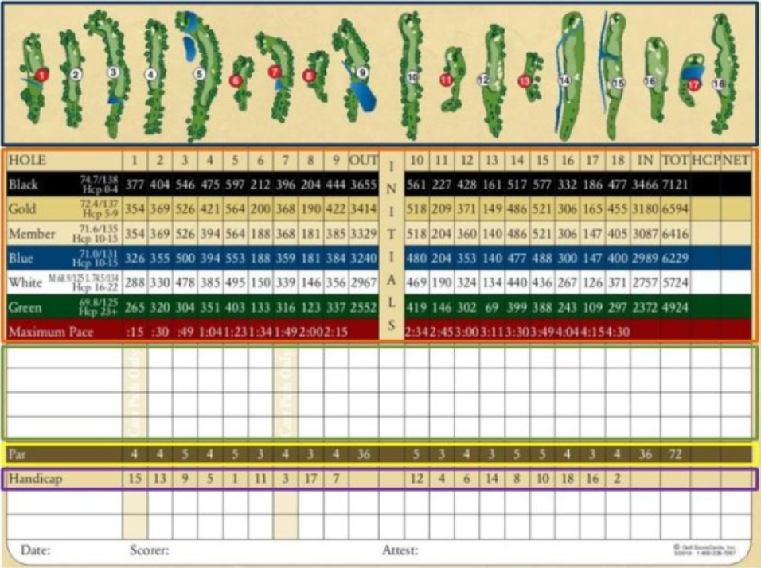
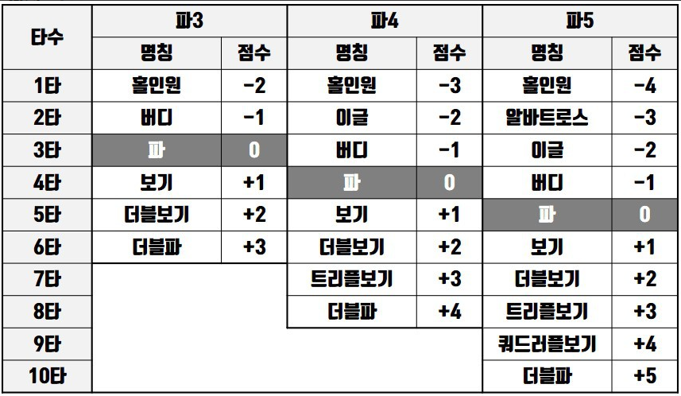
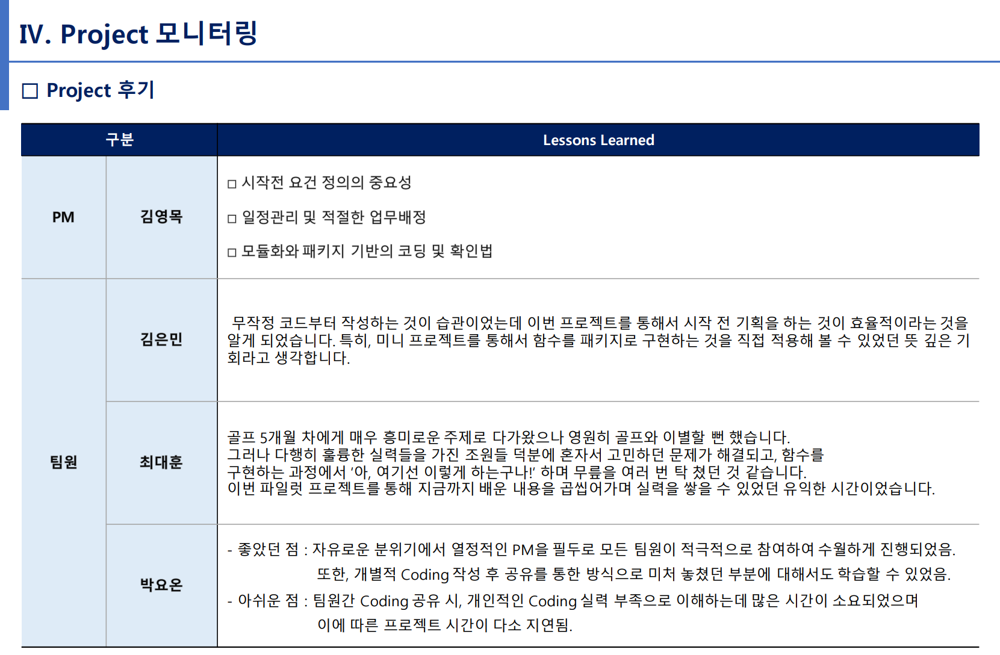
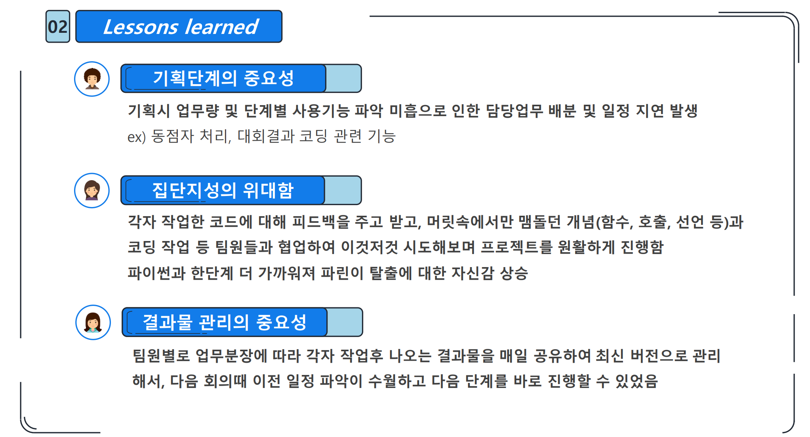
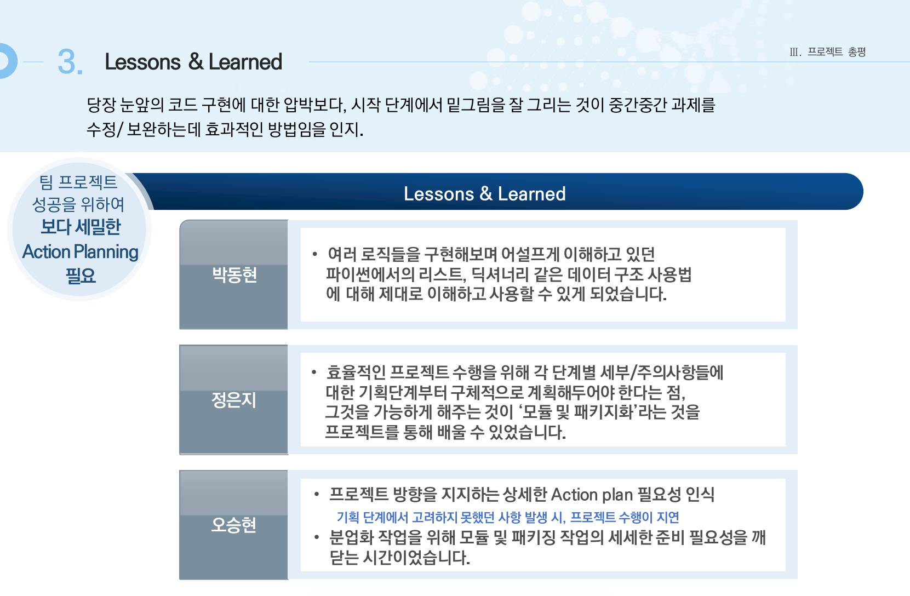

# Data Science Course for JBFG, 2022

Python For BigData @ <a href='https://www.facebook.com/jskim.kr'>FB / jskim.kr</a>, [김진수](bigpycraft@gmail.com)

<h2><b>Pilot Project I</b></h2>

- <b>Project Mission </b> : <b>Golf Score Management Program Implementation </b>

 

## 프로젝트 개요
>  
- 프로젝트 미션 : 골프 스코어 관리자 프로그램 구현
- 프로젝트 목표 : 학습한 Python Programming에 대한 이해와 활용능력 증진 및 협업을 통한 효율적인 업무관리의 중요성 인지
- Keep in Mind : Share Lessons Learned !!!

## 프로젝트 일정

- Team Building : 2022.05.19(목) 
- 과제기획  발표 : 2022.05.20(금) - 기획안 제출    
- 결과보고  취합 : 2022.05.26(목) - 구현 P/G코드와 결과보고서 제출
- 최종보고  발표 : 2022.05.27(금) - 결과보고 발표 및 시현
 

<table border=1>
	<tr align=center>
		<td>
			골프 스코어 카드 샘플
		</td>
		<td>
			골프 스코어 용어 정리
		</td>
	</tr>
	<tr>
		<td>
			
		</td>
		<td>
			
		</td>
	</tr>
</table>

##  프로젝트 결과보고
- 프로젝트 과제  Presentation & Simulation 

### Project Team 1 

<table border=1 width=100%>
	<tr>
		<td width="25%">
<b>Project Team</b>
</td>
		<td width="75%">
 1 팀
</td>
	</tr>
	<tr>
		<td>
<b>Team Members</b>
</td>
		<td>
 김영목(전북은행), 김은민(광주은행), 최대훈(광주은행), 박요온(전북은행) 
</td>
	</tr>
	<tr>
		<td>
<b>Report</b>
</td>
		<td>
			
 
				<a href="./report/P1_결과보고서_1팀.pdf">[1팀 결과보고]</a> , &nbsp;&nbsp;&nbsp; 
				<a href="./source/team1/">[1팀 소스코드]</a>  
			

		</td>
	</tr>
	<tr>
		<td>
<b>Presentation</b>
</td>
		<td>

</td>
	</tr>
</table>

### Project Team 2 

<table border=1 width=100%>
	<tr>
		<td width="25%">
<b>Project Team</b>
</td>
		<td width="75%">
 2 팀 - 파린이
</td>
	</tr>
	<tr>
		<td>
<b>Team Members</b>
</td>
		<td>
 한혜형(전북은행), 박성실(전북은행), 이건호(광주은행) 
</td>
	</tr>
	<tr>
		<td>
<b>Report</b>
</td>
		<td>
			
 
				<a href="./report/P1_결과보고서_2팀.pdf">[2팀 결과보고]</a> , &nbsp;&nbsp;&nbsp; 
				<a href="./source/team2/">[2팀 소스코드]</a>  
			

		</td>
	</tr>
	<tr>
		<td>
<b>Presentation</b>
</td>
		<td>

</td>
	</tr>
</table>

### Project Team 3 

<table border=1 width=100%>
	<tr>
		<td width="25%">
<b>Project Team</b>
</td>
		<td width="75%">
 3 팀 
</td>
	</tr>
	<tr>
		<td>
<b>Team Members</b>
</td>
		<td>
 박동현(광주은행), 정은지(광주은행), 오승현(전북은행) 
</td>
	</tr>
	<tr>
		<td>
<b>Report</b>
</td>
		<td>
			
 
				<a href="./report/P1_결과보고서_3팀.pdf">[3팀 결과보고]</a> , &nbsp;&nbsp;&nbsp; 
				<a href="./source/team3/">[3팀 소스코드]</a>  
			

		</td>
	</tr>
	<tr>
		<td>
<b>Presentation</b>
</td>
		<td>

</td>
	</tr>
</table>

<marquee>The BigpyCraft find the information to design valuable society with Technology & Craft.</marquee>

 &lt; The End &gt; 

