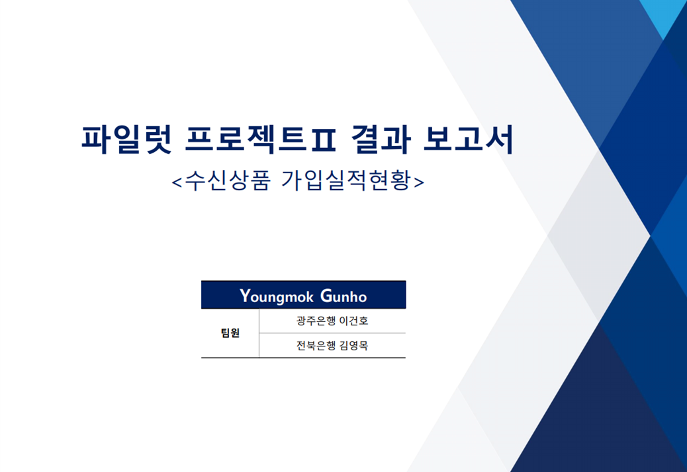
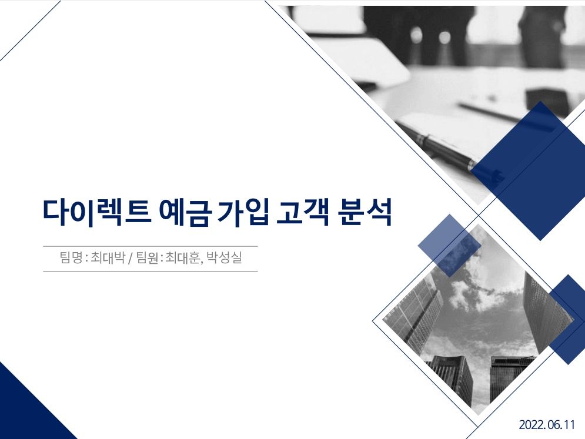
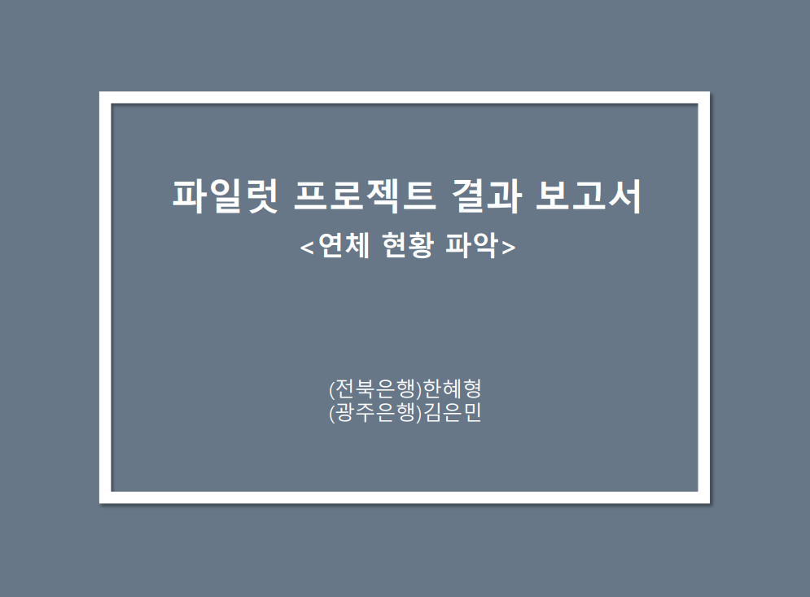
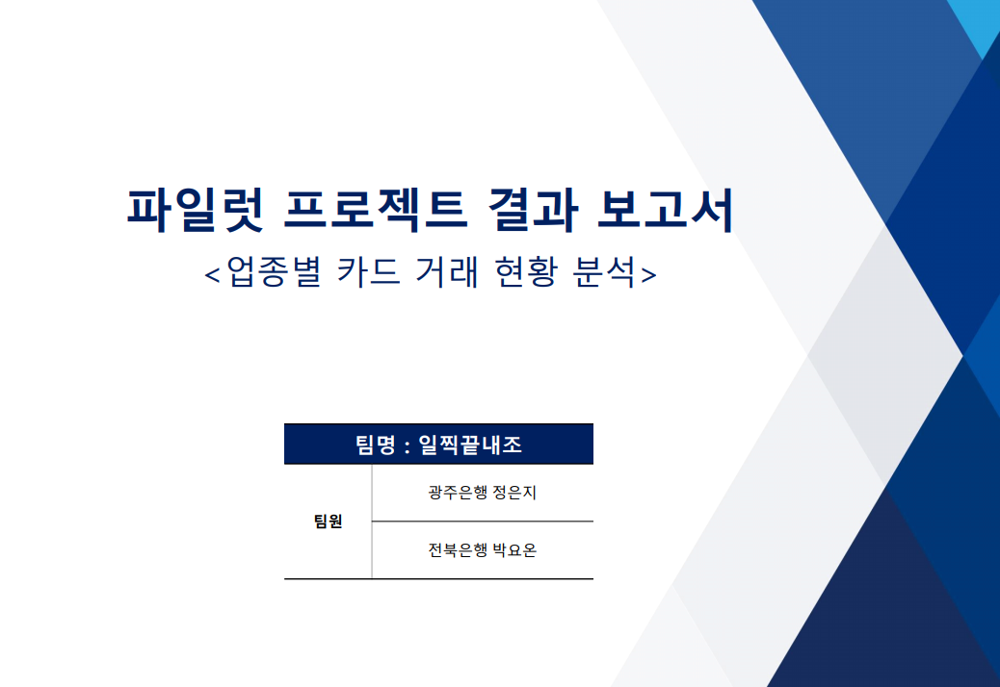
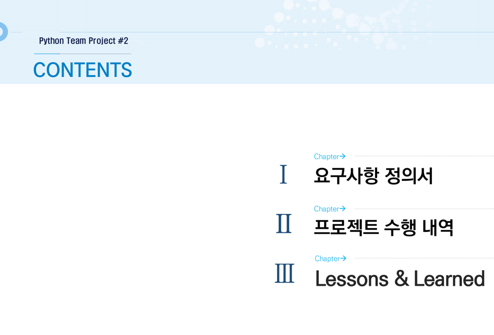

# Data Science Course for JBFG, 2022

Python For BigData @ <a href='https://www.facebook.com/jskim.kr'>FB / jskim.kr</a>, [김진수](bigpycraft@gmail.com)

<h2><b>Pilot Project I</b></h2>

- <b>Project Mission </b> : <b>Practical Data Analysis using Corporate Financial Data </b>

 

## 프로젝트 개요
>  
- 프로젝트 미션 : 금융데이터를 이용한 실무과제 데이터분석
- 프로젝트 목표 : 요청업무에 대한 요구사항분석과 데이터분석을 통한 인사이트 도출
- Keep in Mind : 데이터분석에 대한 이해와 실무 활용능력 배양

## 프로젝트 일정

- 과제미션  발표 : 2022.06.12(화) - 개인별 금융실무데이터 기반 미션 발표
- Team Building : 2022.06.07(화) - 팀빌딩 및 프로젝트과제 선정 
- 결과보고  취합 : 2022.06.12(일) - 단계별 산출물 (요구사항정의서/수행계획서/결과보고서)
- 최종보고  발표 : 2022.06.13(월) - 결과보고 발표 및 시현

 

<table border=1 bgcolor="#EEEEEE">
	<tr bgcolor="#CC0000">
		<td width="100">
<b>Team Name        </b>
</td>
		<td width="150">
<b>Team Building    </b>
</td>
		<td width="250">
<b>Project Subject  </b>
</td>
		<td width="120">
<b>Reports          </b>
</td>
	</tr>
	<tr>
		<td>
 Team-A  <b>YG팀</b>                              
</td>
		<td>
 광주은행 이건호  전북은행 김영목                    
</td>
		<td>
 수신상품 가입실적현황                                  
</td>
		<td>
     
</td>
	</tr>
	<tr>
		<td>
 Team-B  <b>최대박팀</b>                           
</td>
		<td>
 광주은행 최대훈  전북은행 박성실                    
</td>
		<td>
 다이렉트 예금 가입 고객 분석                            
</td>
		<td>
     
</td>
	</tr>
	<tr>
		<td>
 Team-C  <b>YG팀</b>                               
</td>
		<td>
 광주은행 김은민  전북은행 한혜형                    
</td>
		<td>
 연체 현황 파악                                         
</td>
		<td>
     
</td>
	</tr>
	<tr>
		<td>
 Team-D  <b>일찍끝내조</b>                            
</td>
		<td>
 광주은행 정은지  전북은행 박요온                      
</td>
		<td>
 업종별 카드 거래 현황 분석                                
</td>
		<td>
     
</td>
	</tr>
	<tr>
		<td>
 Team-E  <b>쉽지않아팀</b>                            
</td>
		<td>
 광주은행 박동현  전북은행 오승현                       
</td>
		<td>
 카드실적 현황 파악                                        
</td>
		<td>
     
</td>
	</tr>
</table>

<marquee>The BigpyCraft find the information to design valuable society with Technology & Craft.</marquee>

 &lt; The End &gt; 

